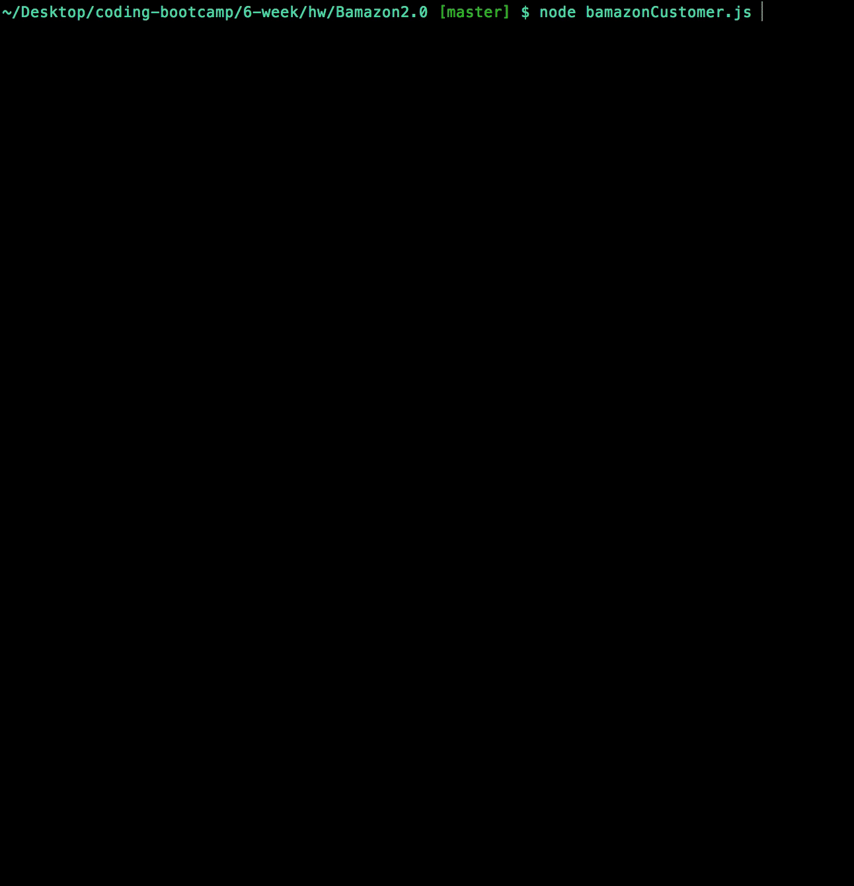
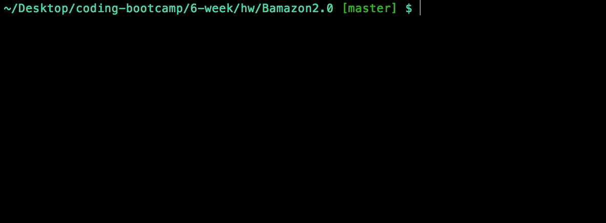

# Bamazon2.0

In this application you can be a customer and buy some groceries, or become a manager and handle inventory. All of this is possible with the help of MySQL.

## Getting Started

Download the repository using the git pull command in your terminal. Before this application is fully functional you'll need to download a few things.

## Prerequisites

* MySQL Database - copy the data in the .sql file and paste it to MySQLWorkbench. This will create a database that holds all the inventory data
* Node
### Installing

You will need to install a few Node packages using Node Package Manager, or npm. The package.json file already has all of the depencencies indicating exactly what you need to install.

```
  "dependencies": {
    "cli-table": "^0.3.1",
    "inquirer": "^5.2.0",
    "mysql": "^2.15.0"
  }
```
A quick npm install will do the trick here

```
npm install
```

## Customer View
In order to see the customer view you will need to call on bamazonCustomer.js. See what's in stock and shop till you drop!



## Manager View
For a Managerial view, you will call bamazonManager.js. Here you can see all sales, add to inventory, and even add cool new items to sell. Be creative!



## Built With

* `JavaScript` - Programming Language
* `Node.js` - JavaScript Runtime
* `request` - Node package
* `inquirer` - Node package
* `cli-table` - Node Package

## Authors

* **Yumna Akhtar** - [Initial Work](https://github.com/yumnakhtar)

## License

This project is licensed under the MIT License - see the [LICENSE.md](LICENSE.md) file for details


